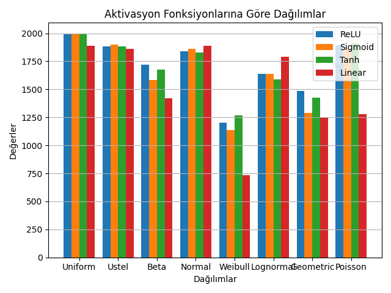
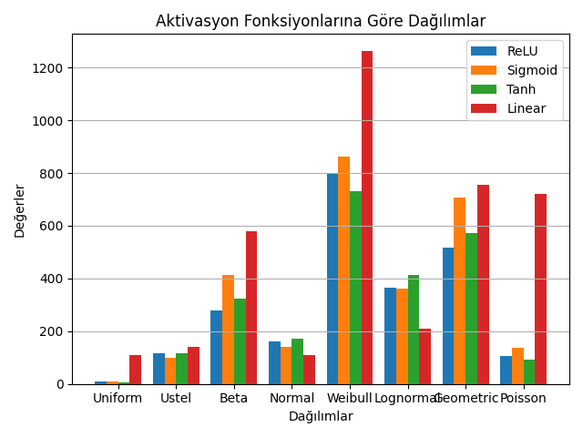
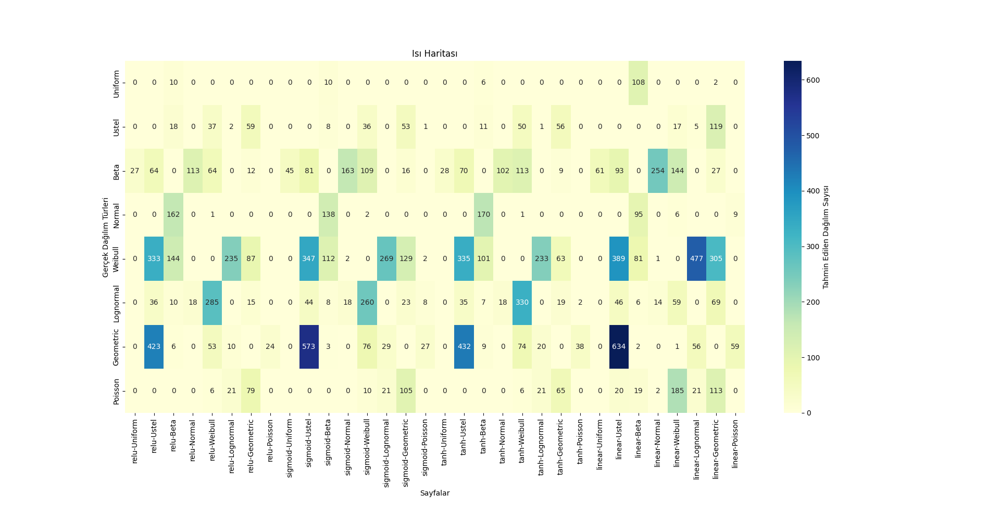
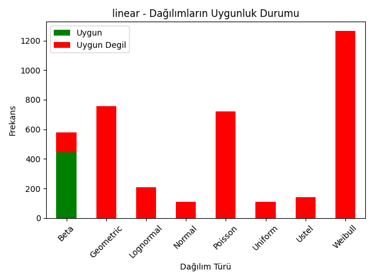
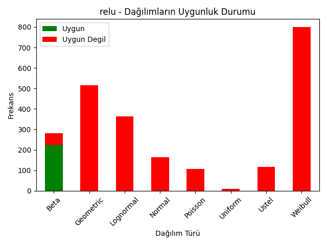
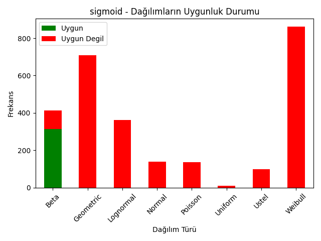
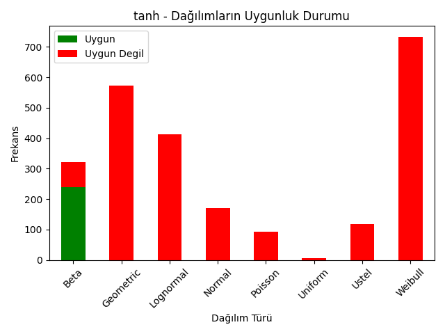
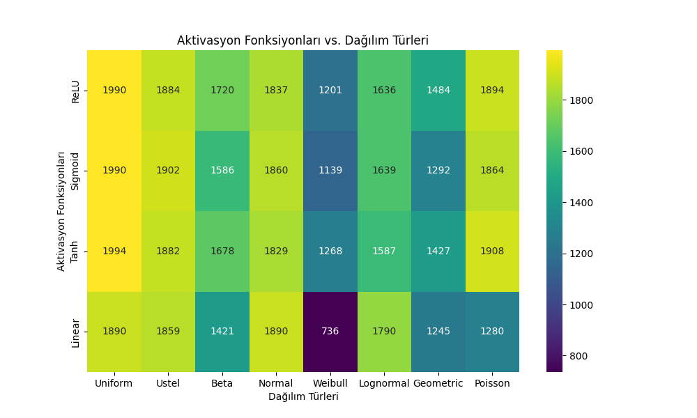

# Artificial Neural Networks and Distribution Fit Tests

## Project Overview

This repository contains a comprehensive study on Artificial Neural Networks (ANNs) and Distribution Fit Tests, focusing on various activation functions and their impacts on prediction accuracy and error distribution.

## Project Structure

```
Artificial Neural Networks and Distribution Fit Tests/
├── generator/
│   ├── generator_95_percent.py
│   └── 9595_example_last_update_control_95_.xls
├── graphs/
│   ├── distribution_of_error_data_by_activation_functions.png
│   ├── distribution_of_non_error_data_by_activation_functions.png
│   ├── heatmap_of_all_error_data.png
│   ├── linear_distribution_goodness_of_fit.png
│   ├── relu_distribution_goodness_of_fit.png
│   ├── sigmoid_distribution_goodness_of_fit.png
│   ├── tanh_distribution_goodness_of_fit.png
│   ├── correct_prediction_data.png
│   ├── linear_quota_table.xlsx
│   ├── relu_quota_table.xlsx
│   ├── sigmoid_quota_table.xlsx
│   ├── tanh_quota_table.xlsx
│   ├── comprehensive_graphing.py
│   ├── data_table_utilities.py
│   ├── fitness_plotting.py
│   ├── matrix_operations.py
│   ├── matrix_plotting.py
│   └── plotting_utilities.py
├── keras/
│   ├── finalize_keras_model_training.py
│   ├── generate_non_compliant_data.py
│   ├── k95_prediction_report_update_control.xlsx
│   └── error_analysis_report_95.xlsx
└── kolmogorov-smirnov/
    ├── distribution_control.py
    └── 95_Confidence_Distribution_Test_Results_All_Sheets.xlsx
```

## Context

This project explores the behavior of Artificial Neural Networks (ANNs) with different activation functions and analyzes the distribution of prediction errors using various statistical tests. The main components and their purposes are:

1. **Data Generation** ([generator/generator_95_percent.py](generator/generator_95_percent.py)): 
   Creates datasets for analysis, with an example output in [9595_example_last_update_control_95_.xls](generator/9595_example_last_update_control_95_.xls).

2. **Neural Network Models** ([keras/finalize_keras_model_training.py](keras/finalize_keras_model_training.py)): 
   Implements and trains the neural network models using Keras. [generate_non_compliant_data.py](keras/generate_non_compliant_data.py) is used to test model robustness.

3. **Error Analysis and Visualization** ([graphs/comprehensive_graphing.py](graphs/comprehensive_graphing.py)): 
   Generates various visualizations to analyze model performance and error distributions. Utilizes helper scripts like [data_table_utilities.py](graphs/data_table_utilities.py), [fitness_plotting.py](graphs/fitness_plotting.py), etc.

4. **Distribution Fit Tests** ([kolmogorov-smirnov/distribution_control.py](kolmogorov-smirnov/distribution_control.py)): 
   Performs Kolmogorov-Smirnov tests to analyze error distributions, with results compiled in [95_Confidence_Distribution_Test_Results_All_Sheets.xlsx](kolmogorov-smirnov/95_Confidence_Distribution_Test_Results_All_Sheets.xlsx).

The project aims to provide insights into the performance of different activation functions and their impact on prediction accuracy and error distributions in neural networks.

[The rest of the README content remains the same]

## Visualizations

### 1. Distribution of Non-Error Data by Activation Functions



This graph illustrates the distribution of correctly predicted data across different activation functions (ReLU, Sigmoid, Tanh, Linear). It provides insights into which activation functions perform better for our specific problem.

### 2. Distribution of Error Data by Activation Functions



This visualization shows how errors are distributed across different activation functions. It helps in identifying which activation functions tend to produce more or fewer errors in different scenarios.

### 3. Heatmap of All Error Data



This heatmap provides a comprehensive view of error patterns across all scenarios. Darker colors typically indicate higher error concentrations, allowing for quick identification of problematic areas.

### 4. Goodness of Fit for Activation Functions

#### Linear Activation Function


#### ReLU Activation Function


#### Sigmoid Activation Function


#### Tanh Activation Function


These graphs demonstrate how well the error distributions for each activation function fit to theoretical probability distributions. They help in understanding the underlying statistical properties of errors produced by each activation function.

### 5. Correct Prediction Data



This visualization focuses on the patterns in correctly predicted data, providing insights into the strengths of our model across different scenarios.

## Usage

1. **Data Generation**: 
   ```
   python generator/generator_95_percent.py
   ```

2. **Model Training**: 
   ```
   python keras/finalize_keras_model_training.py
   ```

3. **Visualization and Analysis**: 
   ```
   python graphs/comprehensive_graphing.py
   ```

4. **Distribution Tests**: 
   ```
   python kolmogorov-smirnov/distribution_control.py
   ```

## Requirements

- Python 3.x
- TensorFlow/Keras
- NumPy
- Pandas
- Matplotlib
- SciPy


## License

[Specify your license here]

## Contact

[Your contact information or link to issues page]